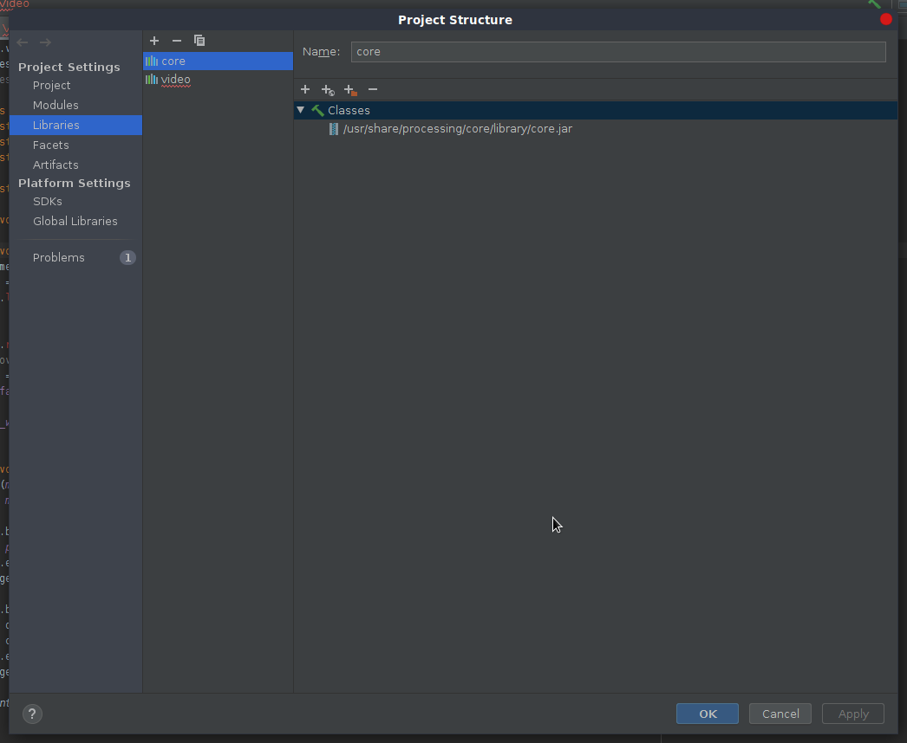
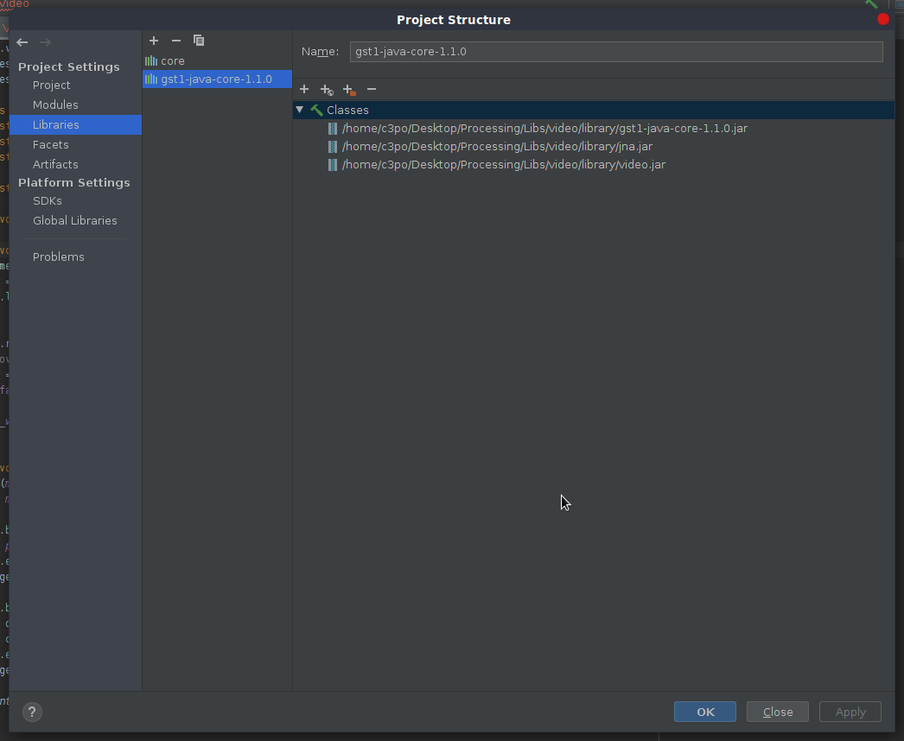
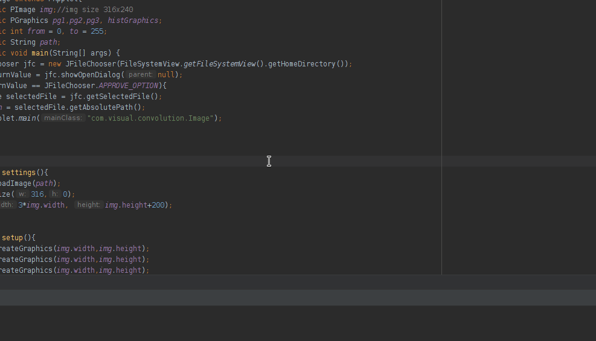

# Taller de análisis de imágenes por software

## Propósito

Introducir el análisis de imágenes/video en el lenguaje de [Processing](https://processing.org/).

## Tareas

Implementar las siguientes operaciones de análisis para imágenes/video:

* Conversión a escala de grises: promedio _rgb_ y [luma](https://en.wikipedia.org/wiki/HSL_and_HSV#Disadvantages).
* Aplicación de algunas [máscaras de convolución](https://en.wikipedia.org/wiki/Kernel_(image_processing)).
* (solo para imágenes) Despliegue del histograma.
* (solo para imágenes) Segmentación de la imagen a partir del histograma.
* (solo para video) Medición de la [eficiencia computacional](https://processing.org/reference/frameRate.html) para las operaciones realizadas.

Emplear dos [canvas](https://processing.org/reference/PGraphics.html), uno para desplegar la imagen/video original y el otro para el resultado del análisis.

### Alternativas para video en Linux y `gstreamer >=1`

Distribuciones recientes de Linux que emplean `gstreamer >=1`, requieren alguna de las siguientes librerías de video:

1. [Beta oficial](https://github.com/processing/processing-video/releases).
2. [Gohai port](https://github.com/gohai/processing-video/releases/tag/v1.0.2).

Descompriman el archivo `*.zip` en la caperta de `libraries` de su sketchbook (e.g., `$HOME/sketchbook/libraries`) y probar cuál de las dos va mejor.

## Integrantes

Completar la tabla:

| Integrante | github nick |
|------------|-------------|
|Diego Said Niquefa Velásquez|niquefaDiego|
|Juan Diego Moreno|judmorenomo|
|Edwin Ricardo Mahecha Parra|ermahechap|

## Discusión

### Descripción de la entrega
En esta entrega se desea realizar convoluciones sobre imágenes y videos. Para ello se hace uso de Processing(y Java más específicamente).

Durante el desarrollo del taller se desarrollaron las siguientes características/funcionalidades:
* División del canvas por medio de PGraphics como *side-canvas* para facilitar la representación de los diferentes elementos.
* Uso de java swing con el objetivo de integrar un *file chooser* (ver ejemplos al final).
* Creación de histograma para visualizar grágicamente la composición de la imágen.
  * Selección de rango sobre el histograma haciendo uso de los métodos de processing *mousePressed()*, *mouseReleased()*, etc. para visualizar únicamente los pixeles cuyo valor se encuentre en el rango seleccionado **(segmentación)**.
* Conversión a escala de grises por avg o luma.
* Muestra del framerate(solo video) en consola.

Para la entrega se crearon las siguientes funciones:

```java
public void decolorizeGraphics(PImage pg, int mode, int hide)
```
* **pg**, es una imagen. Nos aprovechamos del hecho de que java pasa los valores por referencia, por lo que se modifica la imágen original(esto en aplica para el resto de funciones).
* **mode**, toma los valores 0-1.
  * 0: average
  * 1: luma
* **hide** (no aplica para video), oculta/muestra los pixeles en el rango escogido en el histograma, por lo que se utiliza para la segmentación.


```java
public void convoluteGraphics(PGraphics pg)
```
* **pg**, canvas de tipo PGraphics el cual va a ser modificado

  Cabe notar que en la función *convoluteGraphics* es en donde se cambia el kernel a utilizar en la convolución. Para ello se definen dos variables
  ```java
  int m_size=3; //please, just odd matrix
  float[] kernel = {
        -1, -1, -1,
        -1, 8, -1,
        -1, -1, -1
  };
  ```
  en donde m_size es el tamaño del kernel. Nótese que el kernel se define como un arreglo 1D.

```java
public float convolution(PImage slice, float[] kernel)
```
* **slice**, es una imágen de dimensión *m_size x m_size*, resultado de tomar una porción de del PGraphics de la función *convoluteGraphics*.
  
  Esta función retorna el valor de un pixel [0-255], resultado de la convolución.

```java
public void drawHist(PGraphics histogramPg, PGraphics source)
```
* **histogramPg**, es el PGraphics en donde se va a ubicar el histograma
* **source**, es el PGraphics a partir del cual se va a construir el histograma.


### Configuración del entorno
Para la entrega se hace uso de java como lenguaje de progamación, en conjunto con intellij IDEA como editor.

* JDK 8
* [Beta oficial](https://github.com/processing/processing-video/releases), librería utilizada para video.
> Nota: Para usuarios de arch y en general para usuarios de otras distros de linux, es necesario revisar que se instalen algunos de los paquetes especificados [aquí](https://wiki.archlinux.org/index.php/GStreamer), en especial el paquete que contiene los encoders/decoders de video.

Para configurar intellij IDEA es necesario:
1. Descargar el Beta oficial de video de processing en alguna carpeta
2. En intellij IDEA agregar tanto la librería core propia de processing y los paquetes de video que se encuentran en la beta oficial. Para ello en *File>Project Structure* en la pestaña de Librerías agregar:




### Resultados

A continuación se muestra una serie de ejemplos con el comportamiento esperado.




Ambos ejemplos fueron realizados con el kernel de detección de bordes

```java  
  float[] kernel = {
        -1, -1, -1,
        -1, 8, -1,
        -1, -1, -1
  };
  ```
Para el video se estableció un limite de fps de 30, y se calculo el promedio de fps, obteniendo el resultado de 28, así mismo, si incrementó el limite a 60 fps y se obtuvo un promedio de 58 fps.

## Otros recursos
* [Visualización de kernels](http://setosa.io/ev/image-kernels/)
* [Wikipedia - Kernel](https://en.wikipedia.org/wiki/Kernel_(image_processing))


## Entrega

* Plazo para hacer _push_ del repositorio a github: 29/9/19 a las 24h.
